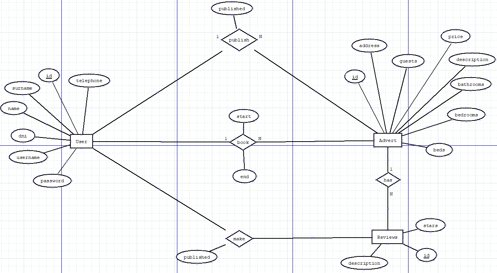
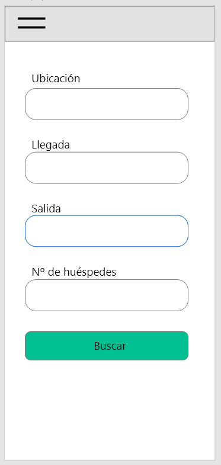

<br />
<p align="center">
  <h3 align="center">Vacational Rental</h3>

  <p align="center">
    A simple application about Vacational Rental
    <br />
    <a href="https://github.com/aaronmed/full-stack-project-vacation"><strong>Explore the docs »</strong></a>
    <br />
    <br />
    <a href="https://github.com/aaronmed/full-stack-project-vacation">View Demo</a>
    ·
    <a href="https://github.com/aaronmed/full-stack-project-vacation/issues">Report Bug</a>
    ·
    <a href="https://github.com/aaronmed/full-stack-project-vacation/issues">Request Feature</a>
  </p>
</p>


<!-- TABLE OF CONTENTS -->
<details open="open">
  <summary>Table of Contents</summary>
  <ol>
    <li>
      <a href="#about-the-project">About The Project</a>
      <ul>
        <li><a href="#entity-relationship-diagram">Entity Relationship Diagram</a></li>
        <li><a href="#use-case-diagram">Use Case Diagram</a></li>
        <li><a href="#mockup">Mockup</a></li>
        <li><a href="#built-with">Built With</a></li>
      </ul>
    </li>
    <li>
      <a href="#getting-started">Getting Started</a>
      <ul>
        <li><a href="#prerequisites">Prerequisites</a></li>
        <li><a href="#installation">Installation</a></li>
      </ul>
    </li>
    <li><a href="#usage">Usage</a></li>
    <li><a href="#roadmap">Roadmap</a></li>
    <li><a href="#contributing">Contributing</a></li>
    <li><a href="#planning">Planning</a></li>
    <li><a href="#license">License</a></li>
    <li><a href="#contact">Contact</a></li>
    <li><a href="#acknowledgements">Acknowledgements</a></li>
  </ol>
</details>


<!-- ABOUT THE PROJECT -->
## About The Project
A simple application in which users will be able to view advertisements for holiday rental. Registered users can book advertisements and publish reviews about them.

#### Entity-Relationship Diagram
<p align="center">
    
  </p>

  * **Entities**
    - User whose primary key is an ID, name, surname, DNI, contact phone, username and password.
    - Advert that has as primary key an identifying id, a basic description about the ad, the address of the ad, the price per night to rent it, the number of: rooms, guests allowed, beds and bathrooms.
    - Reviews that have as a primary key an identifying id, a description of the review and some stars as a numerical evaluation.

  * **Relatioships**
    - The publish relationship is about when a user publishes a certain advertisement on a certain date
    - The book relationship is about when a user books a certain ad by choosing a start date and an end date
    - The make relationship is about when a user makes a criticism about a certain ad on a certain date

#### Use case Diagram
  <p align="center">
    
  </p>

#### User Requirements
* Platform
  - Mobile application

* Users will be able to search for ads to book by indicating the location where they want to stay, the dates they want and the number of guests that will be

* In order to make a book, the user must be registered

* Once you are registered and logged in, you can both book ads and create your own

*  Registered users will be able to leave a review of the ads they have booked

#### Mockup
<p align="center">

 </p>

*Screen 1:* First screen as soon as we enter the application in which we find a small form to be able to make searches of announcements

<p align="center">

</p>

 *Screen 2:* The menu that appears when we are not logged in to the application that simply allows us to search and log in

<p align="center">

</p>

 *Screen 3:* The menu that appears when we are logged in to the application that allows us to go to the search, see our ads, view our reservations and log out

<p align="center">

</p>

*Screen 4:* Menu to login where we will have to give our user name and password, if we do not have an account, we have the button to register

<p align="center">

</p>

*Screen 5:* When you do a search, this would be the screen where the entire list of ads meeting the search criteria would be displayed

<p align="center">

</p>

*Screen 6:* This is the window that shows the details of the ads. We can see all the attributes of the ads, such as the beds, guests, rooms, etc. We also see the reviews that this ad has and an average of them. There is also a button to book the ad if you wish.

### Built With

  * [Spring](https://spring.io/)
  * [MySql](https://www.mysql.com)
  * [GraphQL](https://graphql.org/)
  * [Ionic](https://ionicframework.com/)


<!-- GETTING STARTED -->
## Getting Started

This is an example of how you may give instructions on setting up your project locally.
To get a local copy up and running follow these simple example steps.

### Prerequisites

This is an example of how to list things you need to use the software and how to install them.
* npm
  ```sh
  npm install npm@latest -g
  ```

### Installation


1. Clone the repo
   ```sh
   git clone https://github.com/aaronmed/full-stack-project-vacation.git
   ```
3. Install NPM packages
   ```sh
   npm install
   ```


<!-- USAGE EXAMPLES -->
## Usage

Use this space to show useful examples of how a project can be used. Additional screenshots, code examples and demos work well in this space. You may also link to more resources.

_For more examples, please refer to the [Documentation](https://example.com)_


<!-- ROADMAP -->
## Roadmap

See the [open issues](https://github.com/aaronmed/full-stack-project-vacation/issues) for a list of proposed features (and known issues).


<!-- CONTRIBUTING -->
## Contributing

Contributions are what make the open source community such an amazing place to be learn, inspire, and create. Any contributions you make are **greatly appreciated**.

1. Fork the Project
2. Create your Feature Branch (`git checkout -b feature/AmazingFeature`)
3. Commit your Changes (`git commit -m 'Add some AmazingFeature'`)
4. Push to the Branch (`git push origin feature/AmazingFeature`)
5. Open a Pull Request


## Planning

You can see my [planning](https://github.com/aaronmed/full-stack-project-vacation/projects/1) that I have done in the github repository itself

<!-- LICENSE -->
## License

Distributed under the MIT License. See `LICENSE` for more information.


<!-- CONTACT -->
## Contact

Aarón - aaronmedmel@gmail.com

Project Link: [https://github.com/aaronmed/full-stack-project-vacation](https://github.com/aaronmed/full-stack-project-vacation)


<!-- ACKNOWLEDGEMENTS -->
## Acknowledgements
* [Tiburcio Cruz](https://github.com/tcrurav) 
* [README Template othneildrew](https://github.com/othneildrew/Best-README-Template/blob/master/README.md)


